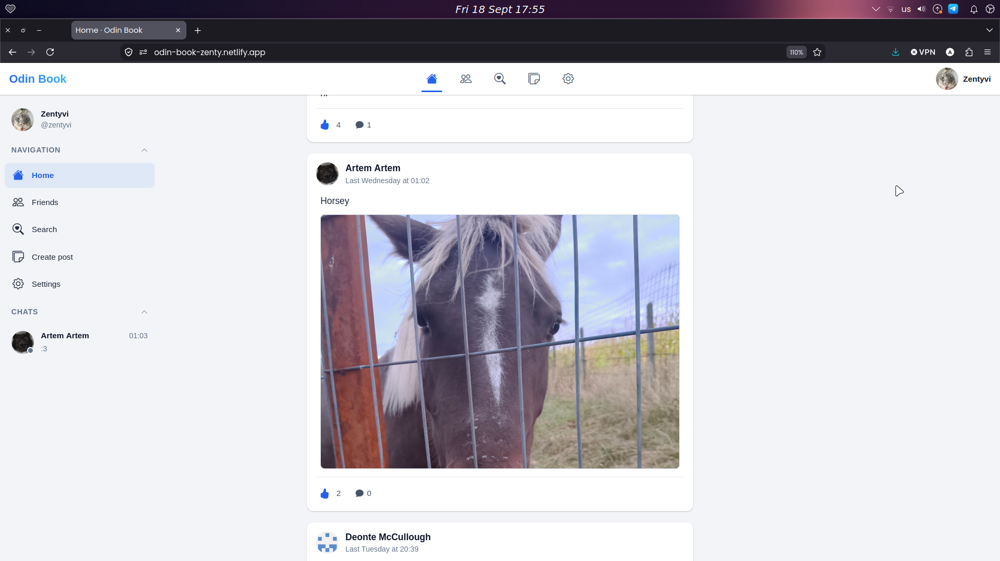
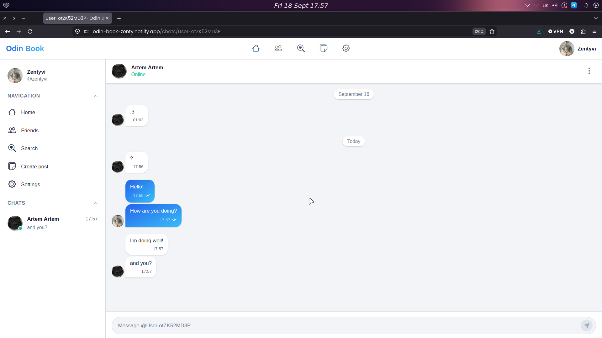
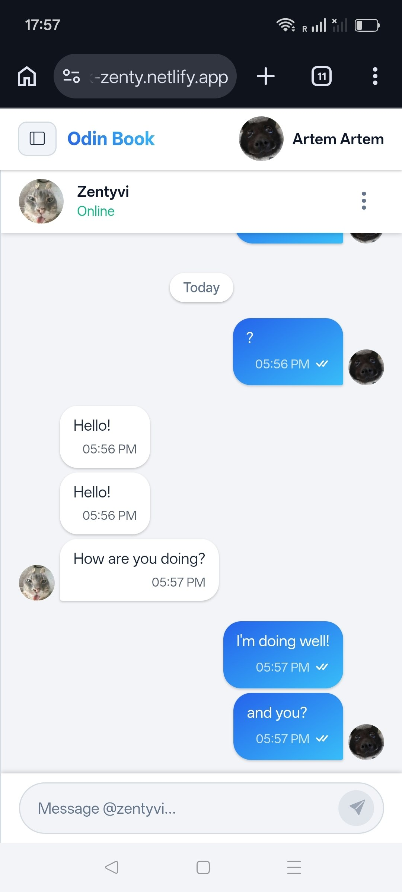
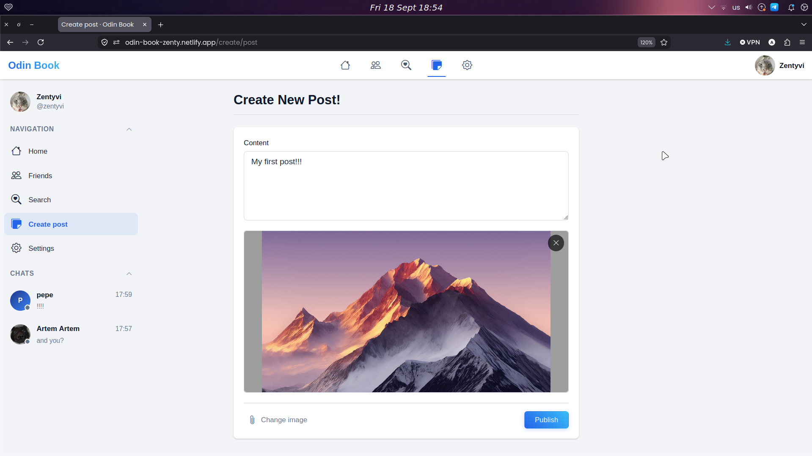
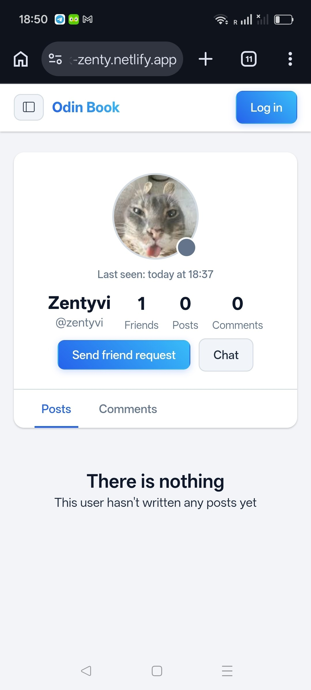

# Odin Book

This is a full-stack social network application created as the final capstone project for [The Odin Project](https://www.theodinproject.com) curriculum.

Online preview: [odin-book-zenty.netlify.app](https://odin-book-zenty.netlify.app)

## Screenshots

| Desktop                                                   | Mobile                                                   |
| --------------------------------------------------------- | -------------------------------------------------------- |
|   |    |
|     |      |
|  |  |

## Features

- **Authentication:** Google & GitHub OAuth, plus custom Username/Password auth.
- **Guest mode:** Guest sign-in functionality that allows visitors to bypass the login screen without creating an account or supplying credentials
- **Friend System:** Send, accept, and manage friend requests.
- **Personalized Feed:** Priority sorting (friend posts first, then user's own posts, followed by public posts).
- **Customizable Profiles:** Fully editable user details, including avatar uploads.
- **Real-Time Messaging:** Live chat and real-time online/offline user status powered by Socket.io.
- **Persistent Settings:** User preferences stored in the database and synchronized across devices.
- **Adaptive layout:** Application looks pretty on desktop and mobile devices. Implemented with CSS media queries.

## Tech Stack

### Frontend

### Backend & Real-time

### Database & Authentication

### Deployment & Hosting

